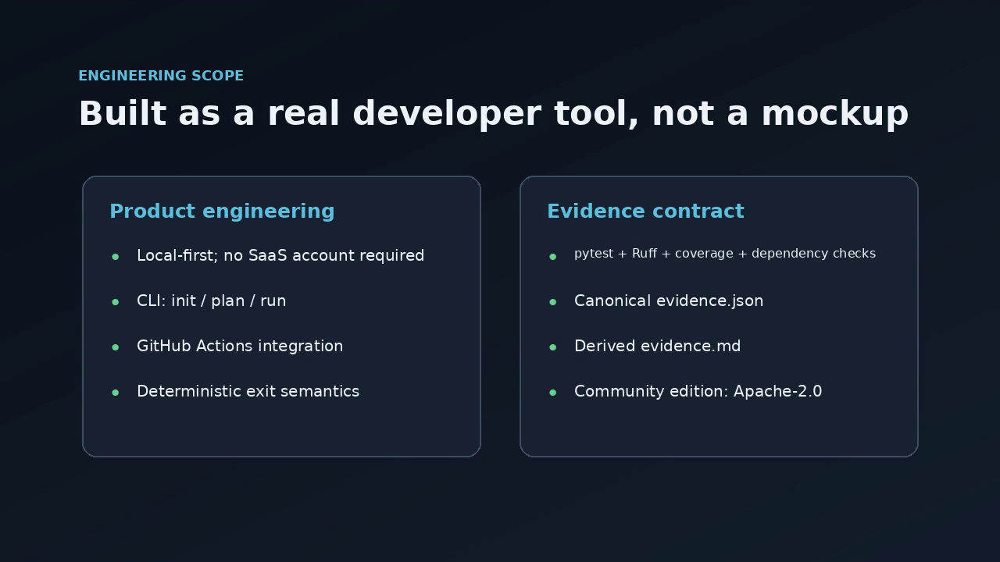

# DiffSeal

Turn Python verification signals into one reproducible review-readiness evidence packet and explicit decision.

DiffSeal is a local-first, Python-first review-readiness gate. It runs the verification tools you already use against one exact repository state, normalizes their output into a single evidence bundle, and produces one explicit decision: is this change ready for review?

## Two product lines

DiffSeal has two product lines:

- **DiffSeal Community — available now.** Free and open-source. Provides the core local-first evidence pipeline, normalized evidence artifacts, deterministic review-readiness decisions, CLI use, and GitHub Actions integration.
- **DiffSeal Pro — commercial edition.** The commercial DiffSeal product line for developers and teams that need deeper change intelligence, richer evidence explanation, and stronger reviewer-facing reporting. Pro is being prepared for launch and is not yet publicly released.

Founding launch: $19 one-time.

## See DiffSeal in action

See the complete DiffSeal workflow in 58 seconds — from Python verification signals to normalized evidence and an explicit review-readiness decision.

[](docs/assets/diffseal-demo-58s.mp4)

▶ [Watch the 58-second DiffSeal demo](docs/assets/diffseal-demo-58s.mp4)

## Quick flow

For a published release, install DiffSeal with:

```bash
pip install diffseal
```

Then, inside a Python repository:

```bash
diffseal init
diffseal plan
diffseal run
```

A run produces one explicit decision and two evidence files:

```
decision: PASS
evidence.json: ...
evidence.md: ...
```

DiffSeal orchestrates and normalizes the verification signals you already use — pytest, Ruff, coverage, and dependency checks — into one review-readiness decision. It does not replace those tools:

```text
Python repository
    |
    +-- pytest
    +-- Ruff
    +-- coverage
    +-- dependency check
            |
            v
    normalized evidence
            |
            v
    PASS / FAIL / REVIEW_REQUIRED / INSUFFICIENT_EVIDENCE
            |
            +-- evidence.json
            +-- evidence.md
```

## Why DiffSeal

Verification output is scattered. A change produces pytest output, Ruff output, coverage output, and dependency availability signals across different logs and exit codes. A reviewer has to gather and interpret all of it manually before deciding whether a pull request is ready.

DiffSeal collects those signals into one normalized evidence packet and gives the reviewer an explicit, reproducible decision instead of a pile of logs.

## Community and Pro

### Community — available now

Community is the free, open-source (Apache-2.0) foundation and the primary path to evaluate and adopt DiffSeal. It is independently useful on its own:

- pytest verification
- Ruff verification
- whole-repository coverage threshold
- declared dependency satisfaction
- `evidence.json` and derived `evidence.md`
- deterministic `PASS` / `FAIL` / `REVIEW_REQUIRED` / `INSUFFICIENT_EVIDENCE` decisions
- CLI: `diffseal init`, `diffseal plan`, `diffseal run`
- GitHub Actions integration
- local-first operation with no SaaS, account, or API-key requirement

### Pro — commercial, coming next

DiffSeal Pro is the proprietary commercial product line. It is being prepared for launch and is not yet publicly released. Its planned direction focuses on deeper change intelligence and reviewer assistance:

- diff/change awareness
- richer evidence explanations
- advanced reviewer-facing reports
- dependency delta if tractable

DiffSeal Pro is the commercial product line. Pro is not part of this Apache-2.0 Community repository.

DiffSeal Pro is being prepared for its founding launch.

**Founding price: $19 one-time.**

Commercial access details will be published separately.

## What it produces

Running DiffSeal writes two files:

- `evidence.json` — the canonical, normalized evidence bundle
- `evidence.md` — a derived, reviewer-friendly summary

The bundle ends with one decision:

- `PASS` — all required evidence is satisfactory
- `FAIL` — evidence established that a required verification failed
- `REVIEW_REQUIRED` — evidence exists but configured policy requires human review
- `INSUFFICIENT_EVIDENCE` — required evidence could not be established (for example, a required tool was unavailable)

`FAIL` means a required check ran and its requirement genuinely failed. `INSUFFICIENT_EVIDENCE` means required evidence could not be established at all — the gate refuses to pass on missing evidence rather than guessing.

## Installation

### Release installation

Install a published release from PyPI with:

```bash
pip install diffseal
```

### Local development installation

From a checkout of this repository:

```bash
python -m venv .venv
source .venv/bin/activate
pip install -e ".[dev]"
```

## Quickstart

Inside a Python repository:

```bash
diffseal init      # create a minimal .diffseal.toml (refuses to overwrite)
diffseal plan      # show which checks would run, without running them
diffseal run       # run checks, evaluate, and write evidence.json + evidence.md
```

`diffseal run` exits with a stable code reflecting the decision:

| Exit code | Meaning |
|-----------|---------|
| 0 | `PASS` |
| 1 | `FAIL` |
| 2 | `REVIEW_REQUIRED` |
| 3 | `INSUFFICIENT_EVIDENCE` |
| 4 | CLI / configuration misuse |
| 5 | Unexpected internal error |

## Example configuration

```toml
[checks.pytest]
enabled = true
required = true
args = ["-q"]

[checks.ruff]
enabled = true
required = true
args = ["check", "."]

[checks.coverage]
enabled = true
required = false
threshold = 80.0
args = ["-q"]

[checks.dependency]
enabled = true
required = false

[evaluation]
# Optional checks listed here force REVIEW_REQUIRED when they fail.
review_on = []

[repository]
# Optional explicit base revision for change context, e.g. "main".
# base_revision = "main"
```

## GitHub Actions

Use the release-specific Action tag in a workflow (see `examples/workflow/diffseal.yml` for a complete example):

```yaml
- uses: zuli2021/diffseal@v0.1.1
  with:
    output-dir: evidence
```

The Action runs the same DiffSeal CLI against the checked-out repository. Upload the evidence artifacts in a later step:

```yaml
- uses: actions/upload-artifact@<sha>
  with:
    name: diffseal-evidence
    path: evidence/
```

The usage example follows least-privilege defaults:

- triggered on `pull_request` (never `pull_request_target`)
- `permissions: contents: read`
- no repository secrets required
- no pull request comments posted

## Evidence example

A compact excerpt from `evidence.json`:

```json
{
  "schema_version": "0.1",
  "product_version": "0.1.0",
  "invocation_mode": "local-cli",
  "checks": [
    {
      "id": "pytest",
      "required": true,
      "outcome": "PASS",
      "summary": "2 passed"
    },
    {
      "id": "ruff",
      "required": true,
      "outcome": "PASS",
      "summary": "no lint violations"
    }
  ],
  "decision": "PASS",
  "decision_reasons": ["all required evidence satisfactory"]
}
```

See `examples/evidence/` for a full committed sample generated by a real `diffseal run` against a standalone Git repository containing the contents of `examples/python-basic/`.

Only the following are normalized for a stable public example:

- `evidence_id` and `run_id` (per-run identifiers vary every run);
- `started_at` and `finished_at` (timestamps vary every run);
- the absolute, machine-specific temporary filesystem prefix of `repository` and `environment_metadata.cwd`, replaced with `examples/python-basic`.

Everything else is preserved from the real run: the `head_revision` is the actual commit SHA of the standalone demo repository used to generate the sample, and check outcomes, the decision, decision reasons, tool results/versions, configuration and policy hashes, and the change summary are all genuine run output.

## Check semantics

Each check reports one outcome:

- `PASS` — the check established that its requirement passed
- `FAIL` — the check established that its requirement failed
- `ERROR` — required evidence could not be established successfully (tool missing, crashed, or unusable)
- `SKIPPED` — the check did not run by design, policy, or an applicable collector condition

`ERROR` and `SKIPPED` are distinct. Neither is silently treated as a pass when the check is required.

## Decision semantics

The gate combines normalized checks deterministically:

1. any required check with `ERROR` or `SKIPPED` → `INSUFFICIENT_EVIDENCE`
2. otherwise, any required check with `FAIL` → `FAIL`
3. otherwise, a configured optional review condition → `REVIEW_REQUIRED`
4. otherwise → `PASS`

The same normalized evidence plus the same policy always produces the same decision.

## Community scope

Community v0.1 collectors:

| Collector | Role |
|-----------|------|
| pytest | Python test execution |
| Ruff | Python lint verification |
| coverage | basic whole-repository coverage threshold |
| dependency | local declared-requirement satisfaction |

The dependency check verifies only that dependencies declared in `pyproject.toml` and/or `requirements.txt` are installed in the local environment and satisfy their declared version constraints. It is **not**:

- a vulnerability scanner
- a dependency security audit
- an SBOM generator
- an advisory database integration

No code is claimed "safe" or "secure" on the basis of DiffSeal output. DiffSeal reports verification evidence and a review-readiness decision.

## Local-first / privacy

DiffSeal:

- executes locally or in your CI provider
- requires no DiffSeal SaaS or account
- requires no API key
- sends no telemetry
- uploads no repository source to a DiffSeal-operated service

DiffSeal runs the tools present in its own environment. Third-party CI providers and their runners have their own policies and are not guaranteed by DiffSeal.

## License

Community is licensed under the Apache License 2.0. See `LICENSE`.

## Status

DiffSeal Community is an early/Alpha release line focused on local-first Python review-readiness evidence. The repository is public. Current release availability is represented by the repository's GitHub Releases and PyPI project page.
